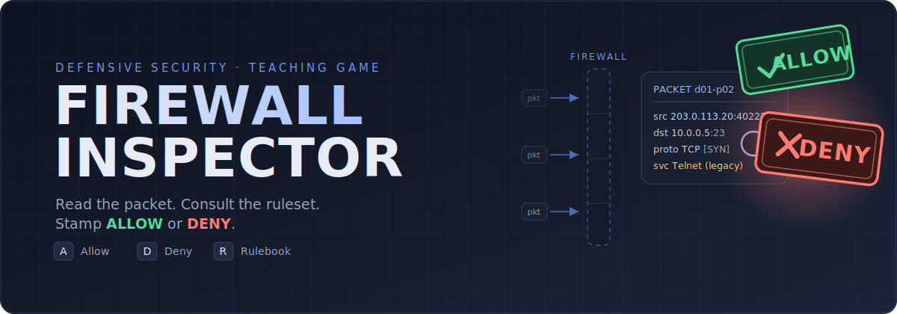

<p align="center">
  
</p>

# Firewall Inspector

A single-player, browser-based, *Papers, Please*–style teaching game. Packets
queue at an inspection desk; you stamp **ALLOW** or **DENY** against a daily
ruleset under a tunable per-shift clock. Wrong calls are explained by naming the
governing rule, and have traceable consequences. Difficulty grows by teaching new
rules and attacker techniques — always **taught before tested**.

- **No install, no account, no backend.** Runs entirely in your browser.
- **No build step, no bundler.** Vanilla HTML/CSS/ES-modules — clone and play.
- **Deterministic.** A pure verdict engine is the single source of truth; the UI
  never decides correctness.
- **Accessible.** Keyboard-operable, screen-reader friendly, no color-only
  meaning, respects `prefers-reduced-motion`. The THREE.js visualization layer is
  optional and decorative.

## Play (clone and play)

ES modules must be served over `http://` (not opened as a `file://` path):

```sh
git clone <repo-url>
cd firewall-inspector
python3 -m http.server 8000      # or: npx serve .
# open the printed URL, e.g. http://localhost:8000/
```

You should see a loading state, then Day 1's briefing, then the inspection desk.

### Controls

| Key | Action |
| --- | --- |
| <kbd>A</kbd> | Stamp **ALLOW** (commits and advances) |
| <kbd>D</kbd> | Stamp **DENY** (commits and advances) |
| <kbd>R</kbd> | Open/close the **rulebook** |
| <kbd>I</kbd> | Open/close the **deep inspector** |
| <kbd>V</kbd> | Toggle the optional **raw payload** view |
| <kbd>P</kbd> | Pause / resume |
| <kbd>?</kbd> | Keyboard help |

## Run the tests (determinism & content integrity)

Requires Node.js (any current LTS) — only for tests, not to play.

```sh
npm test
# equivalently:
node --test tests/unit/      # pure engine, matchers, scoring, consequences, state
node --test tests/content/   # every authored packet: one correct verdict + sources + taught-before-tested
```

Content tests fail loudly if a shift violates an invariant (taught-before-tested,
missing source, undecidable packet, raw-view-required, narrative changes verdict).

## Project layout

```text
index.html          Single entry point
style.css           Theme tokens + component styles
main.js             Bootstrap: load settings/content, state machine, view + key router
engine/             PURE logic (no DOM/I/O): verdict, matchers, consequences, scoring, feedback, state, validators
views/              DOM/SVG rendering: briefing, gameplay, summary, shell
render/             a11y helpers + SVG packet renderer
viz/                OPTIONAL THREE.js blast-radius layer (SVG fallback)
vendor/             Vendored THREE.js ES module (see vendor/README.md)
data/               All game content as JSON: shifts/, schema/, settings.default.json
tests/              node --test: unit/ and content/
```

## Authoring content

All game content is data under `data/shifts/day-NN.json`, validated against
`data/schema/` and by `engine/validators.js`. To add or tune a shift, edit the
JSON and run `npm test` — no code changes needed. Difficulty knobs (`clockSeconds`,
`passThreshold`) and defaults (`data/settings.default.json`) are all data. See
`specs/001-firewall-inspector/contracts/content-schema.md` for the shape and the
enforced invariants.

## Notes

The canonical design lives under `specs/001-firewall-inspector/` (spec, plan,
data model, contracts, quickstart). The legacy root `PLAN.md`/`SPEC.md` describe
an earlier "Packet Quest" routing concept and are superseded by this README and
the `specs/` documents; they are retained only for their tech-stack guidance.
